import useBaseUrl from '@docusaurus/useBaseUrl';

# System Block Diagram

**Figure 1.** 
High level design of the Location Aware AAC application.

## Description

The Location Aware AAC application is a web based assistive communication system built using React for the frontend and Supabase as the backend data platform.
The system dynamically adapts its AAC interface based on the user's physical location, which is detected through Bluetooth beacon signals placed in administrator defined environments.

React manages the user interface, handles user input, displays context relevant icons, constructs sentences from selected symbols, and converts those sentences into speech using text-to-speech technology.

Supabase provides secure storage for user profiles, location metadata, and associated AAC content using a PostgreSQL database, enabling  the frontend to retrieve personalized, location specific communication options in real time.

Together, these components create a responsive and context aware AAC experience that reduces cognitive load and improves communication efficiency for users.

```mermaid
flowchart LR

%% =====================
%% Bluetooth Beacon Layer
%% =====================
subgraph Beacons[Bluetooth Beacon Layer]
    B1[Library Beacon]
    B2[Classroom Beacon]
    B3[Play Area Beacon]
end

%% =====================
%% Child Device / Client Side
%% =====================
subgraph Client[Child Device and Client Side - React Frontend]
    HW[Device Hardware<br/>Tablet / Phone / Chromebook]
    BT[Bluetooth Radio]

    BLE[BLE Scanning Module<br/>Detect Beacon IDs and RSSI]
    CTX[Context Interpreter<br/>Determine Closest Location]
    CACHE[Local State and Cache<br/>Offline Boards and Fallback]

    REACT[React App<br/>UI and State Management]
    AACUI[AAC Interface<br/>Grid Buttons Symbols]
    ICONS[Context Icons and Options<br/>Location Specific]
    SENT[Sentence Builder<br/>Constructs Phrases]
    SPEECH[Speech Output Trigger]
end

%% =====================
%% Backend / Server Side
%% =====================
subgraph Backend[Backend Server Side - Supabase]
    SUPA[Supabase Platform]
    DB[PostgreSQL Database<br/>Profiles Locations AAC Content]
    AUTHDB[Auth and Row Level Security]
    STORAGE[Storage Bucket<br/>Icons Images Optional]
    LOGS[Analytics and Logging]

    SUPA --> DB
    SUPA --> AUTHDB
    SUPA --> STORAGE
end

%% =====================
%% Admin Interface
%% =====================
subgraph Admin[Admin Interface]
    DASH[Admin Dashboard<br/>Manage Locations and AAC Content]
end

%% =====================
%% External Supporting Services
%% =====================
subgraph External[External Supporting Services]
    TTS[Text to Speech Engine]
end

%% =====================
%% Data Flows
%% =====================
B1 --> BLE
B2 --> BLE
B3 --> BLE

HW --> BT --> BLE
BLE --> CTX
CTX --> CACHE

%% React renders the UI and adapts options based on detected location
CTX --> REACT
CACHE --> REACT

REACT --> ICONS
ICONS --> AACUI
AACUI --> SENT --> SPEECH --> TTS

%% Frontend retrieves personalized, location specific options from Supabase
REACT -->|Fetch profiles locations AAC options| SUPA
SUPA -->|Return personalized content| REACT

%% Admin configuration stored in Supabase
DASH -->|Update beacon locations vocab profiles| SUPA

%% Usage logging
REACT --> LOGS
CTX --> LOGS

```

